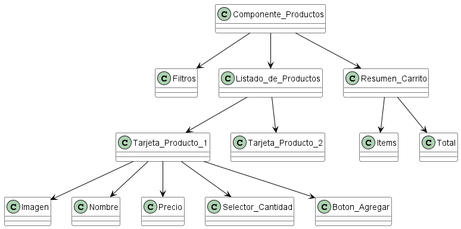
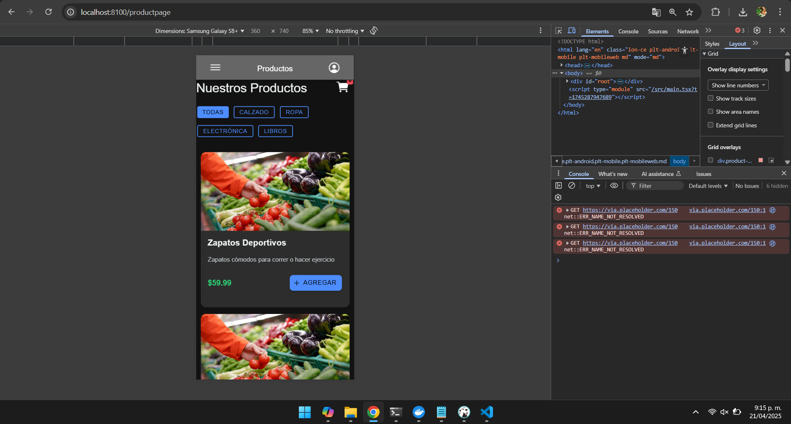

# **HU-01 - Implementación del Componente de Productos**

## **Descripción:**

Desarrollar un componente genérico para visualización y selección de productos que permita:

- Mostrar listado de productos disponibles
- Agregar productos al carrito de compras
- Ajustar cantidades de cada producto
- Visualizar resumen del carrito

## **Criterios de Aceptación:**

✔ Listado de productos con imagen, nombre, precio y selector de cantidad  
✔ Botón "Agregar al carrito" por cada producto  
✔ Visualización del resumen del carrito (productos agregados y total)  
✔ Actualización en tiempo real al modificar cantidades  
✔ Diseño responsive para móvil y escritorio

## **Tareas Técnicas:**

1. **Crear estructura del componente** (`ProductList.tsx`)

   - Definir interfaz de Producto
   - Configurar props del componente
   - Establecer estructura HTML base

2. **Implementar lógica del carrito**

   - Estado para productos seleccionados
   - Funciones para agregar/remover productos
   - Cálculo automático de totales

3. **Diseñar interfaz de usuario**

   - Tarjetas de producto con imagen y detalles
   - Selector de cantidades (mínimo 1, máximo 99)
   - Sección de resumen del carrito

4. **Integrar con estado global**
   - Preparar para conexión con otros componentes
   - Emitir eventos al modificar el carrito

## **Modelo de Datos:**

```typescript
interface Producto {
  id: string;
  nombre: string;
  descripcion?: string;
  precio: number;
  imagen: string;
  categoria: string;
}

interface ItemCarrito {
  producto: Producto;
  cantidad: number;
}
```

### **1️⃣ Diagrama **



### **1️ Evidencias **


