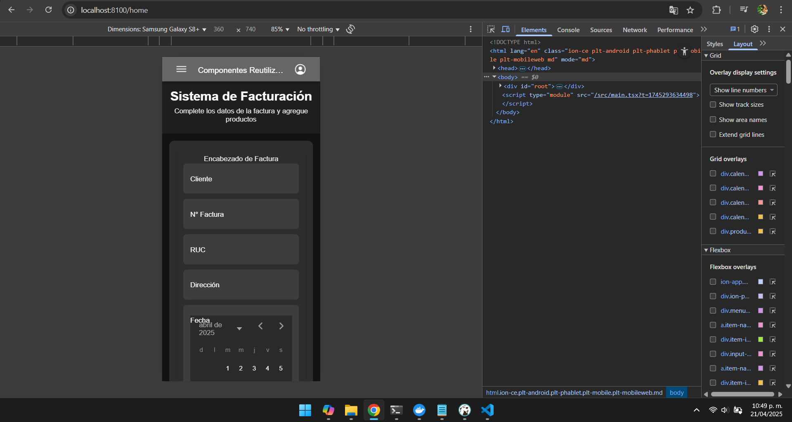
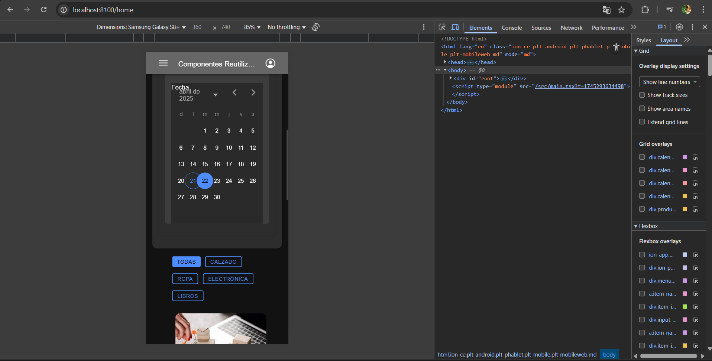

# **HU-02 - Implementación del Componente de Encabezado de Factura**

## **Descripción:**

Desarrollar un componente reutilizable para gestionar el encabezado de facturas con:

- Campos editables para información del cliente
- Configuración de datos de la factura (número, fecha, condiciones)
- Visualización en tiempo real de los cambios
- Integración con el componente de productos

## **Criterios de Aceptación:**

✔ Formulario con campos obligatorios (Cliente, N° Factura, Fecha)  
✔ Validación de formatos (fecha y número de factura)  
✔ Previsualización del encabezado con los datos ingresados  
✔ Conexión con el estado global de la aplicación  
✔ Diseño coherente con el estilo de la aplicación

---

## **Tareas Técnicas:**

### **1. Estructura del Componente** (`InvoiceHeader.tsx`)

```typescript
interface InvoiceHeaderProps {
  clientName: string;
  invoiceNumber: string;
  date: string;
  onDataChange: (field: string, value: string) => void;
}
```

### ** Evidencias **



### \*\* \*\*


