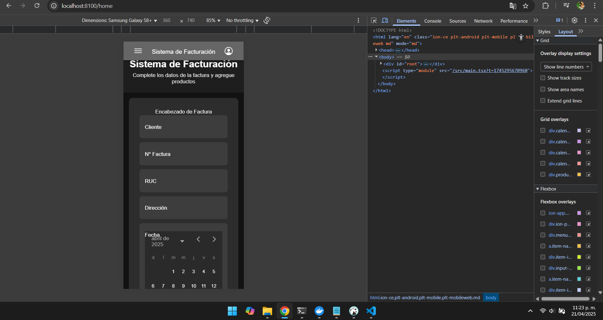
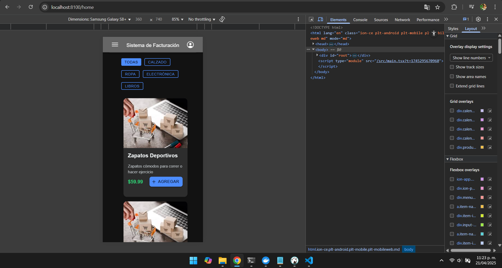

# **HU-03 - Implementación del Componente de Métodos de Pago**

## **Descripción**

Desarrollar un componente modular para selección de métodos de pago con:

- Opciones configurables (efectivo, tarjetas, transferencias)
- Captura de datos específicos por método (ej: último 4 dígitos de tarjeta)
- Validación en tiempo real
- Integración con el flujo de facturación

## **Criterios de Aceptación**

✔ Mostrar métodos disponibles según configuración  
✔ Campos dinámicos según método seleccionado  
✔ Validación de datos sensibles (ej: tarjetas)  
✔ Emitir evento al cambiar selección  
✔ Diseño adaptable a móvil/escritorio

---

## **Especificación Técnica**

### **1. Estructura Principal** (`PaymentMethods.tsx`)

````typescript
type PaymentMethod = {
  id: string;
  name: string;
  icon: string;
  fields?: PaymentField[];
  validationSchema?: yup.Schema;
};

type PaymentField = {
  name: string;
  label: string;
  type: 'text' | 'number' | 'select';
  required?: boolean;
  mask?: string;
};

### **2. Métodos Implementados Inicialmente**
| Método         | Campos Adicionales          | Validación                     |
|----------------|-----------------------------|--------------------------------|
| Efectivo       | -                           | -                              |
| Tarjeta Crédito| Últimos 4 dígitos, Cuotas   | 4 dígitos numéricos            |
| Transferencia  | N° Referencia, Banco        | Formato referencia bancaria    |
| Nequi          | Teléfono                    | Validar número móvil           |


## **Diseño de UI/UX**

### **Flujo de Interacción**
```mermaid
flowchart TB
    A[Selección Método] --> B{Método?}
    B -->|Efectivo| C[Mostrar total]
    B -->|Tarjeta| D[Mostrar campos tarjeta]
    B -->|Transferencia| E[Mostrar datos bancarios]
````

### ** Evidencias_Flujo 01 FACTURAS**



### ** Evidencias_Flujo 02 PRODUCTOS**



### ** Evidencias_Flujo 03 METODOS DE PAGO **


