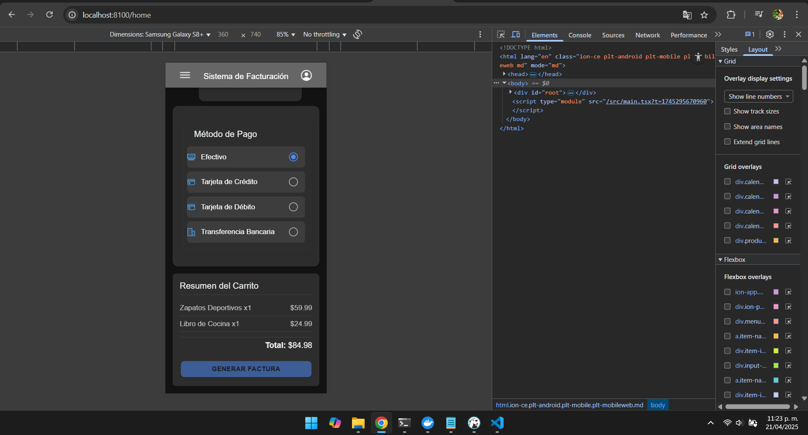

# **HU-04 - Implementación de Pantalla Principal (Home)**

## **Descripción**

Desarrollar la pantalla principal "Home" que integre los componentes existentes para ofrecer un flujo completo de facturación en una única vista.

## **Componentes Integrados**

✔ **ProductList**: Componente para agregar productos al carrito  
✔ **InvoiceHeader**: Sección para configurar encabezado de factura  
✔ **PaymentMethods**: Selector de métodos de pago  
✔ **CustomHeader**: Componente reutilizable para el encabezado de página

## **Criterios de Aceptación**

✅ Todos los componentes visibles en una sola vista sin recargas  
✅ Diseño responsive (mobile/desktop) con disposición lógica  
✅ Comunicación entre componentes para compartir estado  
✅ Validación básica antes de permitir generación de factura

## **Tareas**

1. Crear estructura base de la pantalla Home
2. Integrar los 4 componentes manteniendo su funcionalidad
3. Realizar pruebas de usabilidad básicas

## **Dependencias**

- Componentes existentes (ProductList, InvoiceHeader, PaymentMethods)
- Librería Ionic para componentes UI

## **Notas**

- El CustomHeader mostrará título de página y acciones globales
- No requiere nueva lógica de negocio (usa la de componentes existentes)
- Priorizar experiencia de usuario unificada

## **Pruebas**

✔ Verificar que todos los componentes se rendericen correctamente  
✔ Validar flujo completo en dispositivos móviles  
✔ Confirmar que los datos persisten entre componentes

### ** Evidencias_Flujo 01 FACTURAS**

### ** Evidencias_Flujo 02 PRODUCTOS**

### ** Evidencias_Flujo 03 METODOS DE PAGO **

