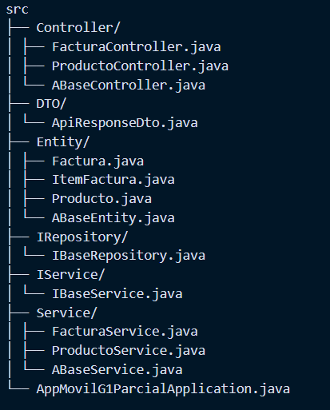

```markdown
# **HU-05 - Implementación Backend Spring Boot con Estructura Base**

## **Descripción**

Implementar el backend para el sistema de facturación utilizando la estructura base proporcionada, con:

- Patrón de diseño por capas (Controller-Service-Repository)
- Entidades JPA para gestión de productos y facturas
- API REST documentada con Swagger/OpenAPI

## **Estructura del Proyecto**


```

## **Endpoints Clave**

### **Productos**

- `GET /api/productos` → Lista todos los productos
- `GET /api/productos/{id}` → Obtiene producto por ID
- `POST /api/productos` → Crea nuevo producto

```json
// Ejemplo Request POST
{
  "nombre": "Laptop",
  "precio": 1200.5,
  "categoria": "Tecnología"
}
```

### **Facturas**

- `POST /api/facturas` → Genera nueva factura

```json
{
  "cliente": "Cliente Ejemplo",
  "items": [
    { "productoId": 1, "cantidad": 2 },
    { "productoId": 3, "cantidad": 1 }
  ],
  "metodoPago": "tarjeta"
}
```

### **Entidades Principales**

| Entidad       | Campos                          |
| ------------- | ------------------------------- |
| `Producto`    | id, nombre, descripción, precio |
| `Factura`     | id, cliente, fecha, total       |
| `ItemFactura` | id, cantidad                    |

## **Endpoints Implementados**

| Método | Endpoint         | Body Request (Ejemplo)                                               |
| ------ | ---------------- | -------------------------------------------------------------------- |
| POST   | `/api/productos` | `{"nombre": "Laptop", "precio": 1500}`                               |
| GET    | `/api/productos` | -                                                                    |
| POST   | `/api/facturas`  | `{"cliente": "ABC Corp", "items": [{"productoId":1, "cantidad":2}]}` |

## **Configuración BD**

```properties
# application.properties
spring.datasource.url=jdbc:mysql://localhost:3306/movil_parcial_c2
spring.jpa.hibernate.ddl-auto=update
```

## **Documentación Adicional**

- Acceso a Swagger UI: `http://localhost:9000/swagger-ui.html`
- Diagrama entidad-relación incluido en `/docs/er-diagram.pdf`

## **Criterios de Aceptación**

✔ Estructura base implementada según diagrama  
✔ CRUD completo para productos  
✔ Creación de facturas con items asociados
✔ Documentación API accesible via Swagger UI  
✔ Validaciones básicas de datos

## **Dependencias**

```xml
<!-- Base -->
<dependency>
    <groupId>org.springframework.boot</groupId>
    <artifactId>spring-boot-starter-data-jpa</artifactId>
</dependency>
<dependency>
    <groupId>com.mysql</groupId>
    <artifactId>mysql-connector-j</artifactId>
</dependency>
```
